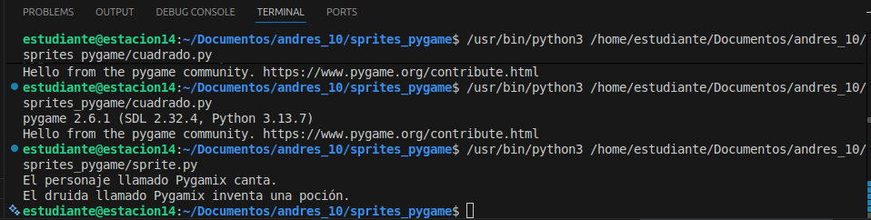
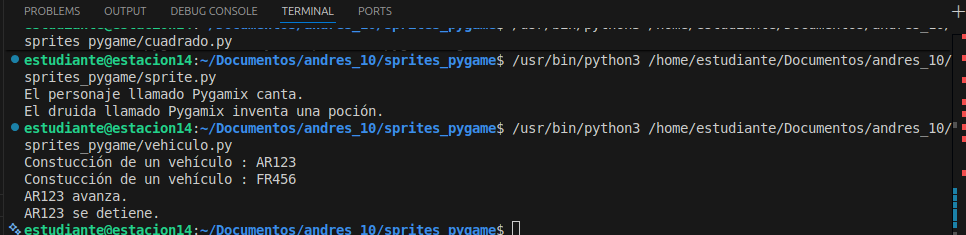
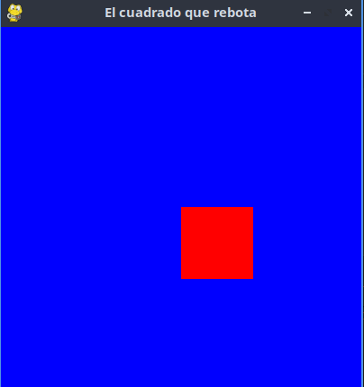

# sprites_pygame
uso y manejo de los sprites

## Clase: 
Es el molde o modelo que agrupa atributos (datos) y métodos (acciones)
## Objeto/Instancia:
Realización concreta de una clase en memoria
## Herencia:
Permite que una clase hija reciba propiedades y métodos de una clase padre para no duplicar código
## Sprite: 
"Imagen-objeto" que asocia ubicación, representación gráfica y propiedades
## Grupo: 
Colección de sprites que permite actualizar y dibujar múltiples objetos en una sola línea
## Self / __init__:
self representa la instancia actual; __init__ inicializa el objeto

1. Clase Vehículo (POO Básica)
class Vehiculo:
    def __init__(self, matricula, color, numeroPuertas): # Inicializa atributos [1, 6]
        self.MATRICULA, self.COLOR = matricula, color # Guarda datos básicos [1]
        self.NUMERO, self.AVANZA = numeroPuertas, False # Define puertas y estado [1, 6]

    def Avanzar(self): self.AVANZA = True # Cambia estado a movimiento [1, 6]
    def Detenerse(self): self.AVANZA = False # Detiene el vehículo [1, 6]

v1 = Vehiculo("AR123", "rojo", 3) # Crea instancia real en memoria [1, 2]
v1.Avanzar() # Llama al método de la instancia [1, 6]

2. Herencia (Personaje y Druida)
class Personaje:
    def __init__(self): self.NOMBRE, self.TIPO = "defecto", "defecto" # Base [2]
    def Cantar(self): print(self.NOMBRE + " canta.") # Acción compartida [2]

class Druida(Personaje): # Hereda de Personaje usando B(A) [2, 5]
    def __init__(self, nombre, nivel):
        self.NOMBRE, self.TIPO, self.NIVEL = nombre, "DRUIDA", nivel # Especializa [2, 5]
    def InventarPocion(self): print(self.NOMBRE + " crea poción.") # Método único [2, 5]

p = Druida("Pygamix", 5) # Crea instancia de clase hija [5]
p.Cantar() # Usa método heredado [5]

3. Sprite en Pygame (Cuadrado que rebota)
import pygame, sys
class CUADRADO(pygame.sprite.Sprite): # Hereda de la clase Sprite de Pygame [7, 8]
    def __init__(self):
        pygame.sprite.Sprite.__init__(self) # Inicia clase madre [4, 7]
        self.image = pygame.Surface((80, 80)); self.image.fill((255,0,0)) # Gráfico [7, 9]
        self.rect = self.image.get_rect(x=200, y=200) # Posición y colisión [7, 9]
        self.VEL = 3 # Atributo de desplazamiento [9]

    def update(self): # Se llama automáticamente en el bucle [9, 10]
        self.rect.x += self.VEL # Mueve el objeto [8, 9]
        if self.rect.x >= 320 or self.rect.x <= 0: self.VEL *= -1 # Rebote [8-10]

pygame.init(); screen = pygame.display.set_mode((400, 400)) # Configuración [4, 8]
grupo = pygame.sprite.Group(); grupo.add(CUADRADO()) # Crea grupo y añade sprite [4, 8]
while True:
    for e in pygame.event.get(): 
        if e.type == pygame.QUIT: sys.exit()
    grupo.update(); screen.fill((0,0,255)); grupo.draw(screen) # Ciclo de actualización [4]
    pygame.display.flip() # Refresca pantalla [8]
## Objetos en Memoria (Explicación)
### Instancias: 
Al ejecutar v1 o p, se reserva un bloque en la RAM con sus atributos específicos (AR123, Pygamix), independientes de otras instancias
### Jerarquía: 
El objeto p (Druida) mantiene un vínculo con la memoria de Personaje para acceder al método Cantar sin duplicarlo
### Sprites y Grupos: 
El grupo es una lista de punteros; al llamar a update(), el motor recorre la lista y ejecuta la lógica individual de cada objeto CUADRADO

# Diseño de la clase persona

# Diseño del vehiculo

# Diseño del cuadrado
